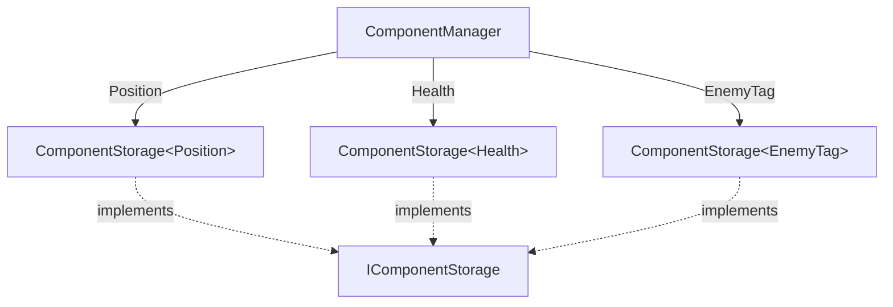

# Component

This folder contains the component layer of the ECS:

| File                   | Content                                                     |
|------------------------|-------------------------------------------------------------|
| `Component.hpp`        | The `Component` concept and `componentTypeId<T>()`          |
| `ComponentStorage.hpp` | `ComponentStorage<T>`: every component of one type, in a sparse set |
| `ComponentManager.hpp` | `ComponentManager`: one storage per component type          |
| `ComponentManager.cpp` | The non-template part of `ComponentManager`                 |

---

## What is a component?

A component is **plain data** attached to an entity. Behavior belongs to
systems, never to components.

```cpp
struct Position { float x{}; float y{}; };      // good: data only
struct Health   { int current{}; int maximum{}; };
struct EnemyTag {};                             // a tag: a component with no data

struct Player { void shoot(); };                // bad: behavior in a component
```

Any **movable object type** can be a component (this is the `Component`
concept). No base class, no registration: a new component type is usable
immediately, without modifying the ECS. References, `const` types and C arrays
are rejected at compile time.

Each component type gets a unique id with `componentTypeId<T>()`. It is derived
from the type itself (`std::type_index`) and is used to find the right storage.

---

## Architecture



- `ComponentManager` holds a map **component type → storage**.
- Each `ComponentStorage<T>` holds **every `T`** of every entity.
- `IComponentStorage` is a small common interface (`remove`, `contains`,
  `size`, `clear`). It lets the manager keep storages of different types in a
  single map and remove a component without knowing its type (`removeAll`).

---

## `ComponentStorage<T>`: the sparse set

Example with `Health` attached to entities `#0`, `#3` and `#2`:

```text
_sparse     [  0 |  - |  2 |  1 ]    indexed by entity id -> slot in the dense arrays
_entities   [ #0 | #3 | #2 ]         dense: packed, no holes
_components [ h0 | h3 | h2 ]         dense: _components[i] belongs to _entities[i]
```

Finding the `Health` of `#3`: `_sparse[3] == 1`, so it is `_components[1]`.
Two array reads: **O(1)**.

Why two levels instead of one array indexed by id? Because `_components` stays
**packed**: iterating over every `Health` reads a contiguous array, which is
very cache friendly. This is what systems and queries will do every frame.

### Insertion

Each entity id owns **at most one slot**.

- The id has no slot yet: the component is appended at the end of the dense arrays.
- The id already has a slot: it is **overwritten**. This covers both
  "the entity already had a `T`" (replacement) and "a previous owner of the
  recycled id left a stale `T` behind" (the stale one is discarded).

### Removal: swap and pop

To remove `#3` (in the middle), the **last** element is moved into the hole,
then the last slot is dropped:

```text
before:  _entities [ #0 | #3 | #2 ]     _components [ h0 | h3 | h2 ]
after:   _entities [ #0 | #2 ]          _components [ h0 | h2 ]
         and _sparse[2] goes from 2 to 1
```

No shifting of the whole array: removal is O(1) too. The order of the dense
arrays is not preserved, which does not matter in an ECS.

### Generations are checked

The storage keeps the full `Entity` (id + generation). `contains()` checks
`_entities[slot] == entity`, so a stale handle `#1g0` never matches the
component of the new owner `#1g1`.

---

## `ComponentManager` API

Every method does the same two things: **find the storage of `T`**, then
**delegate** to it. Only `add` and `storage` may create a storage; every other
method is read-only and safe on a type that was never added.

| Method                 | Returns     | If the entity has a `T`     | If it has none / stale handle | If `T` was never added |
|------------------------|-------------|-----------------------------|-------------------------------|------------------------|
| `add<T>(e, value)`     | `T&`        | replaces it                 | adds it                       | creates the storage, adds it |
| `has<T>(e)`            | `bool`      | `true`                      | `false`                       | `false`                |
| `get<T>(e)`            | `T&`        | the component               | throws `std::out_of_range`    | throws `std::out_of_range` |
| `tryGet<T>(e)`         | `T*`        | pointer to it               | `nullptr`                     | `nullptr`              |
| `remove<T>(e)`         | `bool`      | removes it, `true`          | `false`                       | `false`                |
| `removeAll(e)`         | –           | removes every component of `e`, whatever its type |       |                        |
| `clear()`              | –           | removes every component of every entity (storages are kept) | |                    |
| `storage<T>()`         | `ComponentStorage<T>&` | –                |                               | creates an empty storage |
| `findStorage<T>()`     | `ComponentStorage<T>*` | –                |                               | `nullptr`              |

`get` and `tryGet` also exist in `const` versions returning `const T&` / `const T*`.

### `get` or `tryGet`?

- `get<T>(e)`: "this entity **must** have a `T`". If not, it is a programming
  error, so an exception is thrown.
- `tryGet<T>(e)`: "this entity **may** have a `T`". Absence is a normal case.

```cpp
components.get<Health>(player).current -= 10;          // the player always has Health

if (Shield* shield = components.tryGet<Shield>(player)) { // a shield is optional
    shield->strength -= 10;
}
```

---

## Step-by-step example

Output of a real program using these classes (`#2g1` = id 2, generation 1):

```cpp
ecs::EntityManager entities;
ecs::ComponentManager components;
auto ship = entities.create(), enemy = entities.create(), missile = entities.create();
```

| Code                                   | `Health` storage after the call                      | Result |
|----------------------------------------|------------------------------------------------------|--------|
| *(nothing added yet)*                  | does not exist                                       | `has<Health>(ship) == false` |
| `add(ship, Health{100})` … `add(missile, Health{1})` | `[#0g0 #1g0 #2g0]` → `[100 30 1]` | storage created by the first `add` |
| `add(enemy, Health{25})`               | `[#0g0 #1g0 #2g0]` → `[100 25 1]`                    | replaced, size unchanged |
| `get<Health>(ship).current -= 10`      | `[#0g0 #1g0 #2g0]` → `[90 25 1]`                     | modified in place |
| `tryGet<Position>(ship)`               | –                                                    | `nullptr`, no `Position` storage created |
| `get<Position>(ship)`                  | –                                                    | throws `std::out_of_range` |
| `remove<Health>(ship)`                 | `[#2g0 #1g0]` → `[1 25]`                             | `true`; the last one filled the hole |
| `remove<Health>(ship)` again           | unchanged                                            | `false` |
| `removeAll(enemy)`                     | `[#2g0]` → `[1]`                                     | its other components (any type) are removed too |

---

## Pitfalls

1. **Never keep a reference or a pointer returned by `get`, `tryGet` or `add`.**
   It becomes invalid as soon as:
   - a `remove` of the same type moves the last element into a hole;
   - an `add` of the same type grows the vector (reallocation).

   Keep the **`Entity`** instead (stable, protected by its generation) and call
   `get` again when you need the component.

2. **The `ComponentManager` does not check whether an entity is alive.** It
   only maps *(entity, type) → component*. Game code goes through the `World`,
   which checks liveness and calls `removeAll` when an entity is destroyed.

3. **Memory of `_sparse` grows with the highest entity id**, not with the
   number of components. Since entity ids are recycled, they stay small and
   this is not an issue in practice.

---

## Adding a new component type

1. Declare a struct with data only, in the layer it belongs to (game
   components go in the game layer, never in `src/ecs/`).
2. Use it: `components.add(entity, MyComponent{...})`.

That's all: no registration, no ECS modification.

Tests: [`tests/ecs/Component/`](../../../tests/ecs/Component).
