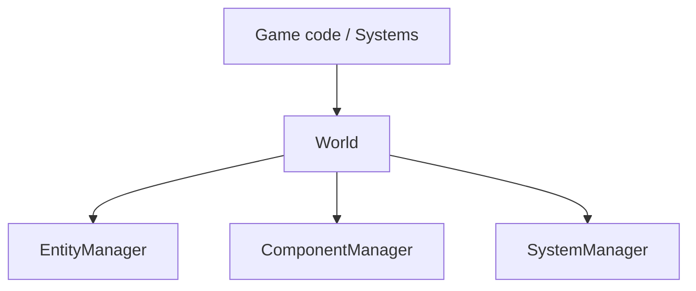

# World

This folder contains the `World`, the **main entry point of the ECS**.

| File        | Content                                         |
|-------------|-------------------------------------------------|
| `World.hpp` | The `World` class, including the `query` method |
| `World.cpp` | The non-template part of `World`                |

---

## Why a World?

The ECS is made of independent building blocks:

- the `EntityManager` ([`../Entity`](../Entity/README.md)) creates and validates entity handles;
- the `ComponentManager` ([`../Component`](../Component/README.md)) stores components;
- the `SystemManager` ([`../System`](../System/README.md)) owns and runs the systems.

None of them knows about the others. The `World` is a **facade** that owns them
and keeps them consistent:



Game code and systems only talk to the `World`. They never touch the managers
directly.

What the `World` adds on top of the two managers:

| Rule                                                   | Where                  |
|--------------------------------------------------------|------------------------|
| Destroying an entity also removes **all** its components | `destroyEntity`      |
| A component can only be added to an **alive** entity   | `addComponent`         |
| Iterating over entities owning a set of components     | `query`                |
| Running every system with the time of the frame        | `update`               |

---

## API

### Entities

| Method                | Behavior                                                         |
|-----------------------|------------------------------------------------------------------|
| `createEntity()`      | Returns a new alive entity, with no component                    |
| `destroyEntity(e)`    | Destroys `e` **and** removes all its components. `false` if `e` was not alive |
| `isAlive(e)`          | `true` if `e` refers to an existing entity (id **and** generation match) |
| `entityCount()`       | Number of alive entities                                         |
| `clear()`             | Destroys every entity and every component (systems are kept)     |

### Components

| Method                     | Behavior                                                  |
|----------------------------|-----------------------------------------------------------|
| `addComponent(e, value)`   | Attaches (or replaces) a `T`, returns `T&`. Throws `std::invalid_argument` if `e` is not alive |
| `hasComponent<T>(e)`       | `true` if `e` owns a `T`                                   |
| `getComponent<T>(e)`       | Returns `T&`. Throws `std::out_of_range` if `e` has no `T` |
| `tryGetComponent<T>(e)`    | Returns `T*`, or `nullptr` if `e` has no `T`               |
| `removeComponent<T>(e)`    | Detaches the `T` of `e`. `false` if it had none            |

`getComponent` and `tryGetComponent` also exist in `const` versions.

Why only `addComponent` checks that the entity is alive: since `destroyEntity`
removes every component, a dead (or stale) handle can never own a component.
`has`/`get`/`remove` naturally answer "no component" for it.

### Systems

| Method           | Behavior                                                       |
|------------------|----------------------------------------------------------------|
| `systems()`      | The `SystemManager` of this World: `world.systems().add<MovementSystem>()` |
| `update(time)`   | Runs every system once, in insertion order, with the given [`Time`](../Time/README.md) |

---

## Queries

A query visits **every entity that owns all the requested component types**:

```cpp
world.query<Position, Velocity>(
    [](ecs::Entity entity, Position& position, Velocity& velocity) {
        position.x += velocity.dx;
        position.y += velocity.dy;
    });
```

- The callback receives the entity, then **one reference per component type**,
  in the same order as the template arguments.
- References are writable: modifying them modifies the stored components.
- Tags filter entities like any other component:

```cpp
world.query<Position, PlayerTag>([](ecs::Entity, Position& position, PlayerTag&) {
    // players only
});
```

- The callback signature is checked at compile time: a wrong parameter list is
  a compilation error, not a runtime bug.

### How it works

```cpp
world.query<Position, Velocity, PlayerTag>(...);
```

1. Find the storage of each type. If one of them does not exist (that type was
   never added), no entity can match: return immediately.
2. Pick the **smallest** storage. Every matching entity is necessarily in it,
   and it has the fewest candidates to check. With 1000 entities having a
   `Position` but only 2 having a `PlayerTag`, only 2 entities are checked.
3. For each entity of that storage, check that it is in **every** other storage.
4. If so, call the callback with the entity and its components.

```text
Position  storage: #0 #1 #2 #3 ... #999     (1000)
Velocity  storage: #0 #1 #5 ...             (300)
PlayerTag storage: #0 #7                    (2)    <- iterated

#0: Position? yes  Velocity? yes  -> callback(#0, ...)
#7: Position? yes  Velocity? no   -> skipped
```

Each check is O(1) (sparse set lookup), so a query costs
O(size of the smallest storage × number of types).

### Rules

- **The iteration order is unspecified.** Never rely on it.
- **Do not change the structure of the World inside a query callback**: no
  `createEntity`, `destroyEntity`, `addComponent` or `removeComponent`. These
  modify the storages being iterated. Modifying the *values* of components is
  fine. Structural changes will be deferred with the `CommandBuffer`.
- **Do not keep the references** received by the callback after it returns
  (see the pitfalls in [`../Component`](../Component/README.md#pitfalls)).

---

## Example

Output of a real program (`#0` = entity with id 0):

```cpp
ecs::World world;

auto ship = world.createEntity();
world.addComponent(ship, Position{0, 50});
world.addComponent(ship, Velocity{10, 0});
world.addComponent(ship, PlayerTag{});

auto enemy = world.createEntity();
world.addComponent(enemy, Position{100, 50});
world.addComponent(enemy, Velocity{-5, 0});
world.addComponent(enemy, EnemyTag{});

auto wall = world.createEntity();            // scenery: no Velocity
world.addComponent(wall, Position{60, 0});
```

| Step                                         | Result                                              |
|----------------------------------------------|-----------------------------------------------------|
| Frame 0                                      | `#0 (0, 50)`  `#1 (100, 50)`  `#2 (60, 0)`          |
| `query<Position, Velocity>` (move), frame 1  | `#0 (10, 50)` `#1 (95, 50)`   `#2 (60, 0)` ← the wall has no `Velocity`: not visited |
| Frame 2                                      | `#0 (20, 50)` `#1 (90, 50)`   `#2 (60, 0)`          |
| `query<Position, PlayerTag>`                 | only `#0`                                           |
| `destroyEntity(enemy)`                       | 2 entities alive, `hasComponent<Position>(enemy) == false` |
| `addComponent(enemy, Velocity{})`            | throws `std::invalid_argument`                      |

The movement code never knows whether it moves a player, an enemy or a
missile: it only knows `Position + Velocity`. This is the core idea of an ECS.

Tests: [`tests/ecs/World/`](../../../tests/ecs/World).
